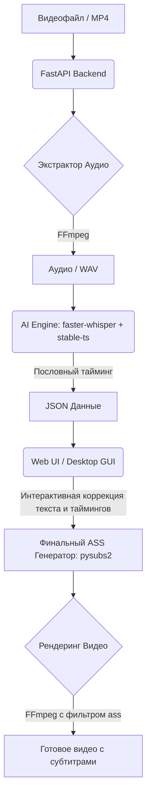

# Сравнение решений для генерации CapCut-субтитров на базе ИИ

В данном отчете представлено подробное сравнение трех подходов к автоматическому распознаванию речи и генерации стилизованных пословных субтитров (ASS с эффектами) для коротких видео (Reels/Shorts/TikTok).

---

## Сравнительная таблица решений

| Критерий сравнения | 1) stable-ts (Stable Whisper) | 2) WhisperX (с обертками) | 3) Собственное GUI/Web-решение |
| :--- | :--- | :--- | :--- |
| **Точность таймингов (слов)** | **Очень высокая**. Анализирует веса внимания (attention heads) внутри Whisper для поиска границ слов. | **Максимальная**. Использует принудительное выравнивание (Forced Alignment) через фонетические модели (wav2vec 2.0). | **Зависит от ядра**. Будет такой же, как у выбранного ядра (`stable-ts` или `WhisperX`). |
| **Скорость работы** | **Высокая** (при использовании бэкенда `faster-whisper`). | **Экстремальная**. Поддерживает батчинг (обработку пакетами) из коробки, работает быстрее всех на длинных аудио. | **Высокая**. Полностью оптимизирована под конкретную задачу без лишних шагов. |
| **Простота запуска и использования** | **Очень простая**. Устанавливается одной командой (`pip install stable-ts`), имеет простой консольный интерфейс (CLI). | **Средне-сложная**. Требует компиляторов, библиотеки PyTorch и загрузки отдельных моделей выравнивания. | **Очень простая для пользователя** (интерфейс «одной кнопки»), но **требует времени на разработку**. |
| **Гибкость стилизации и анимации** | **Средняя**. Умеет генерировать базовый караоке-ASS (`\k` теги), но кастомные эффекты требуют доработки напильником. | **Низкая (из коробки)**. Не генерирует ASS сам — отдает только JSON с таймингами. Требует написания своего парсера. | **Абсолютная**. Можно реализовать любые анимации (появление слов, пульсация активного слова, разные цвета спикеров). |
| **Потребление ресурсов (RAM/VRAM)** | **Стандартное**. Зависит от размера используемой модели Whisper (от 1 ГБ до 6 ГБ VRAM). | **Высокое**. Требует память под модель Whisper + под фонетическую модель Wav2Vec + под модель диаризации. | **Стандартное/Высокое**. Зависит от выбранного бэкенда распознавания. |
| **Поддержка русского языка** | **Отличная**. Полностью зависит от выбранной мультиязычной модели Whisper (например, `large-v3`). | **Хорошая**, но требует автоматической загрузки русскоязычной модели выравнивания (например, `UAlignt / wav2vec`). | **Идеальная**. Можно встроить собственные словари автозамены опечаток Whisper и словари ударений. |
| **Возможность редактирования** | **Только через консоль/код**. Нельзя легко поправить опечатку перед рендерингом видео. | **Только через консоль/код**. Нет визуального редактора ошибок распознавания. | **Полная**. Интерактивный таймлайн позволяет отредактировать текст и тайминги перед тем, как «запечь» субтитры. |
| **Лицензия** | **MIT** (свободная, коммерческое использование разрешено). | **BSD-2-Clause / GPL** (свободная, но требует внимания при интеграции в закрытые проекты). | **Собственная** (вы решаете сами, какой код сделать открытым). |

---

## Подробный разбор каждого решения

### 1. stable-ts (Stable Whisper)
> [!NOTE]
> Это лучший выбор для быстрого старта «прямо сейчас» в консоли.

* **Плюсы:**
  * Практически не требует настройки, ставится через стандартный менеджер пакетов.
  * Напрямую из коробки сохраняет результат в ASS (`result.to_ass("sub.ass", word_level=True)`).
  * Активно поддерживается сообществом, регулярно обновляется под новые версии моделей OpenAI.
* **Минусы:**
  * Стандартный ASS-экспорт выглядит довольно просто (классическое караоке-заполнение).
  * Для реализации сложных эффектов (например, когда активное слово увеличивается в размере по сравнению с остальными или плавно выкатывается) всё равно придется писать свой постобработчик ASS на Python.

### 2. WhisperX
> [!WARNING]
> Решение обладает избыточной сложностью для коротких видеороликов (Shorts/Reels), но незаменимо для длинных подкастов.

* **Плюсы:**
  * Феноменальная точность совпадения звука и появления букв на экране благодаря Forced Alignment.
  * Встроенная функция **диаризации** (различает голоса спикеров). Можно автоматически красить текст Маши в розовый, а Саши — в синий.
  * Прекрасная скорость на длинных аудиофайлах благодаря оптимизации батчей.
* **Минусы:**
  * Очень тяжелые зависимости (PyTorch, torchaudio, pyannote и др.). Установка на некоторых системах может вызвать проблемы с версиями CUDA.
  * Отсутствие готового генератора красивых субтитров. Вам выдается сырой JSON с миллисекундами для каждого слова. Чтобы превратить это в CapCut-стиль, нужно написать 150-200 строк кода сборки ASS с нуля.

### 3. Собственное GUI/Web-решение (например, Python + FastAPI + Next.js или PySide6)
> [!TIP]
> Это идеальный долгосрочный продукт, если вы хотите создать инструмент профессионального уровня для себя или для дистрибуции.

* **Плюсы:**
  * **Контроль над результатом:** Вы можете реализовать фирменные пресеты стилей (Yellow Outline, Neon Glow, Cyberpunk) и анимаций (Pop, Bounce, Slide), которые будут рендериться мгновенно.
  * **Интерактивный редактор:** Whisper ошибается в именах собственных, брендах и сленге. В своем приложении вы можете вывести текст на экран, дать пользователю возможность поправить опечатки за 30 секунд и только потом нажать кнопку «Рендерить».
  * **Удобство:** Никакой консоли — перетащили видео, подождали 15 секунд, скачали готовый результат.
* **Минусы:**
  * Требуется время на проектирование архитектуры, верстку интерфейса и отладку интеграции бэкенда с фронтендом.
  * Необходимость поддерживать кодовую базу и обновлять AI-зависимости при выходе новых версий библиотек.

#### 🛠 Рекомендуемый стек технологий и архитектурная схема

При создании собственного решения для генерации субтитров в стиле CapCut целесообразно разделить проект на два ключевых слоя: **высокопроизводительный бэкенд на Python** (работа с ИИ, аудио и видео) и **интуитивный кроссплатформенный фронтенд**.

##### 1. Ядро обработки и ИИ-движок (Core & AI Engine)
*   **Язык программирования:** **Python 3.10+**. Является отраслевым стандартом для машинного обучения, обеспечивая интеграцию со всеми AI-библиотеками.
*   **Распознавание речи:** **`faster-whisper`** (C++ порт оригинального Whisper от OpenAI с использованием библиотеки `CTranslate2`).
    *   *Почему:* Работает до 4 раз быстрее оригинального Whisper, потребляет значительно меньше видеопамяти (VRAM), поддерживает запуск как на GPU (CUDA/TensorRT), так и на CPU с высокой оптимизацией 8-битного квантования (`int8`).
*   **Сверхточное выравнивание слов (Word Alignment):** **`stable-ts`** (Stable Whisper).
    *   *Почему:* Устраняет проблему «галлюцинаций» и сдвига таймингов Whisper. Скрипт анализирует внутренние веса внимания нейросети (attention maps) и находит точные границы начала и конца каждого произнесенного слова.
*   **Диаризация (Разделение говорящих):** **`pyannote.audio`** (опционально).
    *   *Почему:* Позволяет определять, какой голос звучит в данный момент. Это дает возможность бэкенду разделять речь спикеров и накладывать караоке-субтитры разных цветов (например, желтый цвет для Спикера 1, зеленый — для Спикера 2).
*   **Обработка медиаконтента:** **`FFmpeg`** (через Python-библиотеку `ffmpeg-python`).
    *   *Почему:* Позволяет извлекать аудиодорожки из видео любого формата на лету, пережимать аудио в нужную частоту дискретизации (16 кГц для Whisper) и «запекать» готовый `.ass` файл в видеопоток с аппаратным ускорением (NVENC для NVIDIA, VAAPI для Linux/Intel, VideoToolbox для macOS).
*   **Программная сборка ASS:** **`pysubs2`**.
    *   *Почему:* Мощная библиотека для чтения и записи ASS/SSA файлов. Она позволяет нативно задавать шрифты, обводки, тени, позиции и динамически внедрять теги эффектов (караоке `\k`, масштабирование `\fscx`, движение `\move`) без ручной рутинной работы со строками.

##### 2. Веб-архитектура приложения (Client-Server Web App)
Для максимальной масштабируемости и кроссплатформенности лучше всего развернуть клиент-серверную архитектуру:

*   **API Бэкенд:** **FastAPI**.
    *   *Почему:* Самый быстрый асинхронный Python-фреймворк. Поддерживает WebSockets (необходимы для передачи прогресса распознавания в реальном времени, например: *«Распознано: 15%... 32%...»*), а также автоматическую валидацию типов через `Pydantic` и интерактивную документацию Swagger/OpenAPI.
*   **Интерфейс (Frontend):** **Next.js** (React) + **TypeScript**.
    *   *Почему:* Обеспечивает быстрый рендеринг, поддержку интерактивных плееров и сложных UI-компонентов.
    *   *Ключевые фичи интерфейса:*
        *   *Интерактивный таймлайн:* Отображение звуковой волны (с использованием библиотеки `wavesurfer.js`) с наложенными метками слов. Пользователь может перетаскивать границы слов мышкой.
        *   *Быстрый текстовый редактор:* Двухпанельный редактор (оригинал видео + текстовые блоки). Whisper часто ошибается в сленге или названиях компаний (например, пишет "капкат" вместо "CapCut"). Быстрое исправление текста перед рендерингом экономит часы работы.
        *   *Кастомизатор стилей:* Визуальная панель с выбором шаблонов (шрифт, размер, цвет заливки, цвет обводки, типы плашек, эффекты свечения и анимации bounce/pop).
*   **Стилизация интерфейса:** **Vanilla CSS** или **TailwindCSS** в сочетании с библиотеками готовых анимированных компонентов (например, **Framer Motion**).

##### 3. Локальное десктопное приложение (Desktop GUI Alternative)
Если вам нужно упаковать приложение в единый исполняемый EXE/App-файл, работающий локально без интернета и веб-сервера:

*   **Фреймворк:** **PySide6 / PyQt6** (официальная библиотека Python для привязки к Qt6).
    *   *Почему:* Кроссплатформенный инструмент, позволяющий верстать сложные интерфейсы с GPU-ускорением отрисовки. Отлично подходит для создания локальных инструментов монтажера.
    *   *Сборка дистрибутива:* Используется **PyInstaller** или **Nuitka** для компиляции Python-кода, библиотек ИИ (PyTorch/CUDA) и FFmpeg в единый установщик.

---

### Резюме: С чего начать разработку?

Для быстрого создания прототипа (MVP) идеальный путь выглядит так:
1. Создать легковесный скрипт на **Python 3** с использованием библиотеки **`stable-ts`** (для распознавания) и **`pysubs2`** (для генерации красивого ASS с анимациями).
2. Обернуть скрипт в простой API-эндпоинт на **FastAPI**.
3. Написать одностраничный интерфейс на **Next.js**, который принимает видео, отправляет его по API, получает текст, выводит его в виде списка редактируемых карточек с таймкодами и отправляет финальный вариант обратно на рендеринг через FFmpeg.

